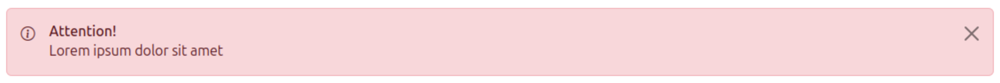

# Alert

Provide contextual feedback messages for typical user actions with the handful of available and flexible alert messages.
See [Bootstrap](https://getbootstrap.com/docs/5.3/components/alerts/) documentation for further information.

~~~html
# Twig
<twig:Alert variant="primary"/>

# HTML

~~~

~~~html
# Variant (required)
<twig:Alert variant="primary"/>
<twig:Alert variant="secondary"/>
<twig:Alert variant="info"/>
<twig:Alert variant="success"/>
<twig:Alert variant="warning"/>
<twig:Alert variant="danger"/>
<twig:Alert variant="light"/>
<twig:Alert variant="dark"/>
~~~

Info: [Available variants](variants.md)

~~~html
# Message or content (optional)
<twig:Alert type="success" message="Your action was successful!"/>
<twig:Alert type="danger">
    <strong>Heads up!</strong>
</twig:Alert>

# HTML

    Your actions was successful!

~~~

~~~html
# Title (optional)
<twig:Alert type="info" title="Hello world!"/>
~~~

~~~html
# Icon (optional)
<twig:Alert type="secondary" icon="bi bi-info-circle-full"/>
~~~

~~~html
# Dismissible (optional)
<twig:Alert type="warning" dismissible/>
~~~

~~~html
# All options

# Twig
<twig:Alert variant="danger" icon="bi bi-info-circle" title="Attention!" message="Lorem ipsum dolor sit amet" dismissible="true"/>

# HTML

	
	

		<h6 class="alert-heading mb-0">Attention!</h6>
		
Lorem ipsum dolor sit amet

	

	<button type="button" class="btn-close" data-bs-dismiss="alert" aria-label="Close"></button>

~~~

