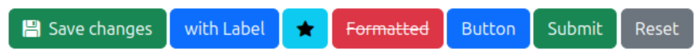
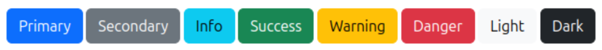

# Button

 * Icon is styled by Bootstrap Icons.

~~~html
# Twig
<twig:Button variant="primary" label="Button"/>

# HTML
<button class="btn btn-primary" type="button">Button</button>
~~~

 * Variants are styled by Bootstrap.

~~~html
# Variant (required)
<twig:Button variant="primary" label="Primary"/>
<twig:Button variant="secondary" label="Secondary"/>
<twig:Button variant="info" label="Info"/>
<twig:Button variant="success" label="Success"/>
<twig:Button variant="warning" label="Warning"/>
<twig:Button variant="danger" label="Danger"/>
~~~

Info: [Available variants](variants.md)

~~~html
# Label (optional)
<twig:Button variant="danger" label="Cancel"/>
<twig:Button variant="danger">Cancel</twig:Button>

# HTML
<button class="btn btn-danger" type="button">Cancel</button>
~~~

~~~html
# Type (optional)
<twig:Button variant="danger" label="Delete"/>
<twig:Button variant="success" label="Save" type="submit"/>
<twig:Button variant="warning" label="Reset" type="reset"/>

# HTML
<button class="btn btn-danger" type="button">Delete</button>
<button class="btn btn-success" type="submit">Save</button>
<button class="btn btn-warning" type="reset">Reset</button>
~~~

~~~html
# Icon (optional)
<twig:Button variant="info" icon="bi bi-info-circle-full"/>
<twig:Button variant="success" label="Ok" icon="bi bi-check"/>

# HTML
<button class="btn btn-info" type="button">
    
</button>
<button class="btn btn-success" type="button">
    
    Ok
</button>
~~~

~~~html
# Passing additional attributes (optional)
<twig:Button variant="success" icon="bi bi-check" label="Ok" class="btn-lg"/>

# HTML
<button class="btn btn-success btn-lg" type="button">
    
    Ok
</button>
~~~

~~~html
# Button group

    <twig:Button variant="success" label="Left"/>
    <twig:Button variant="warning" label="Middle"/>
    <twig:Button variant="danger" label="Right"/>

# HTML

    <button class="btn btn-success" type="button">Left</button>
    <button class="btn btn-warning" type="button">Middle</button>
    <button class="btn btn-danger" type="button">Right</button>

~~~
