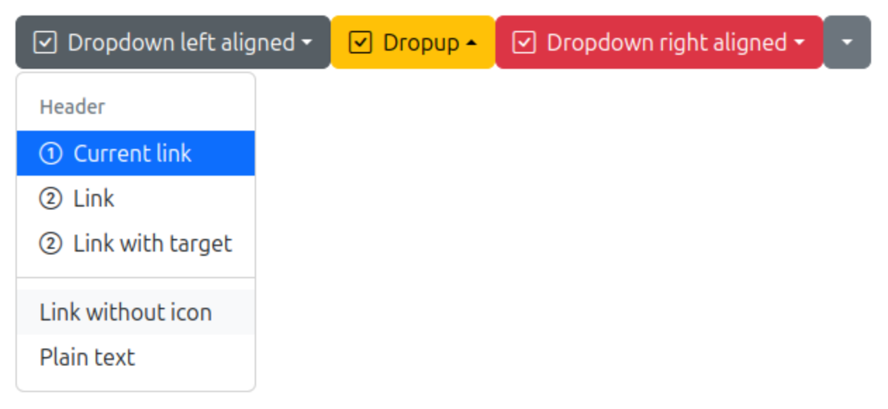

# Dropdowns

Provide toggleable and contextual overlays for displaying lists of links and more.
See [Bootstrap](https://getbootstrap.com/docs/5.3/components/alerts/) documentation for further information.

 * Icon is styled by Bootstrap Icons.

~~~php
# PHP
# Dropdown items are required (greater than one item)
$dropdownItems = [];
$dropdownItems[] = new DropdownHeader(label: 'Header');
$dropdownItems[] = new DropdownItem(label: 'Current link', link: '#', icon: 'bi bi-1-circle', isCurrent: true);
$dropdownItems[] = new DropdownItem(label: 'Link', link: '#', icon: 'bi bi-2-circle');
$dropdownItems[] = new DropdownItem(label: 'Link with target', link: '#', target: '_blank', icon: 'bi bi-2-circle');
$dropdownItems[] = new DropdownDivider();
$dropdownItems[] = new DropdownItem(label: 'Link without icon', link: '#');
$dropdownItems[] = new DropdownText(text: 'Plain text');
~~~

~~~html
# Twig
<twig:Dropdown items="{{ dropdown_items }}" label="Dropdown left aligned" icon="bi bi-check-square"/>
~~~

~~~html
# HTML

    <button class="btn btn-secondary dropdown-toggle show" type="button" data-bs-toggle="dropdown" aria-expanded="true">
        
        Dropdown left aligned
    </button>
    <ul class="dropdown-menu">
        <li>
            <h6 class="dropdown-header">Header</h6>
        </li>
        <li>
            <a class="dropdown-item active" href="#" target="_self" aria-current="true">
                
                Current link
            </a>
        </li>
        <li>
            <a class="dropdown-item" href="#" target="_self">
                
                Link
            </a>
        </li>
        <li>
            <a class="dropdown-item" href="#" target="_blank">
                
                Link with target
            </a>
        </li>
        <li>
            
</li>
        <li>
            <a class="dropdown-item" href="#" target="_self">Link without icon</a></li>
        <li>
            Plain text
        </li>
    </ul>

~~~

~~~html
# Variant (optional, default: secondary)
<twig:Dropdown variant="primary"/>
<twig:Dropdown variant="secondary"/>
<twig:Dropdown variant="info"/>
<twig:Dropdown variant="success"/>
<twig:Dropdown variant="warning"/>
<twig:Dropdown variant="danger"/>
<twig:Dropdown variant="light"/>
<twig:Dropdown variant="dark"/>
~~~

Info: [Available variants](variants.md)

~~~html
# Label (optional)
<twig:Dropdown items="{{ dropdown_items }}" label="Lorem ipsum"/>

# HTML

    <button class="btn btn-secondary dropdown-toggle show" type="button" data-bs-toggle="dropdown" aria-expanded="true">
        Lorem ipsum
    </button>
    <ul class="dropdown-menu">
    ...
    </ul>

~~~

~~~html
# Icon (optional)
<twig:Dropdown items="{{ dropdown_items }}" icon="bi bi-star-fill"/>

# HTML

    <button class="btn btn-secondary dropdown-toggle" type="button" data-bs-toggle="dropdown" aria-expanded="false">        
        
    </button>
    <ul class="dropdown-menu">
    ...
    </ul>

~~~

~~~html
# DropUp (optional)
<twig:Dropdown items="{{ dropdown_items }}" :isDropUp="true"/>

# HTML

    <button class="btn btn-secondary dropdown-toggle show" type="button" data-bs-toggle="dropdown" aria-expanded="true"></button>
    <ul class="dropdown-menu">
    ...
    </ul>

~~~

~~~html
# Right aligned menu (optional)
<twig:Dropdown items="{{ dropdown_items }}" :isRightAligned="true"/>

# HTML

    <button class="btn btn-secondary dropdown-toggle show" type="button" data-bs-toggle="dropdown" aria-expanded="true"></button>
    <ul class="dropdown-menu dropdown-menu-end">
    ...
    </ul>

~~~
